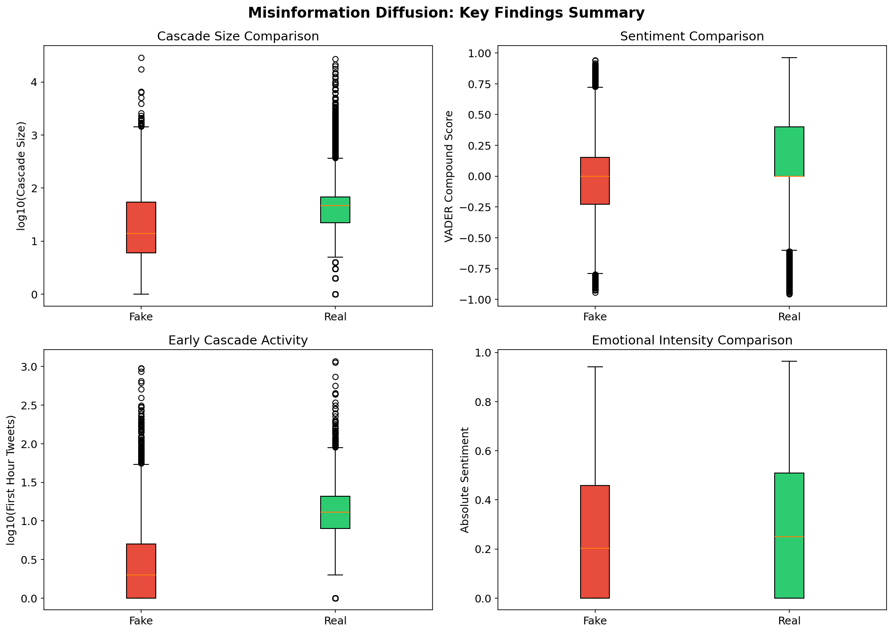

# Misinformation Diffusion on Social Media: A Network and Text Analysis



## Overview
This project investigates the structural and temporal differences between the spread of misinformation ("fake news") and factual news on social media. By analyzing over **2 million tweet events** and **23,000 news articles** from the **FakeNewsNet** dataset, we provide empirical evidence of how misinformation thrives in segregated "echo chambers" and exhibits unique diffusion dynamics.

## Key Findings
*   **Echo Chamber Resilience:** Misinformation networks are **8$\times$ denser** and **7$\times$ more clustered** than factual news networks. We identified extreme audience segregation, with a negligible number of "cross-edges" between fake and real news communities.
*   **The "Slow-Burn" Model:** Contrary to the myth of sudden viral explosions, fake news cascades are characterized by **4.4$\times$ longer persistence** (duration) compared to factual news, which typically dies out after an initial burst.
*   **Negativity Bias:** Fake news headlines are significantly more **negative** (29.1%) than factual news (21.8%), though sentiment intensity alone is a weak predictor of total reach.
*   **Superstar Distribution:** Misinformation reach follows a "hit or miss" pattern; while most fake stories fail to gain traction, a small percentage of "superstar" cascades achieve reach far exceeding that of factual news.

## Methodology
The project is organized into a modular pipeline:
1.  **Network Science:** Building co-sharing graphs to identify overlapping audiences and community clusters using `NetworkX`.
2.  **Cascade Analysis:** Extracting timestamps from Twitter Snowflake IDs to model the velocity and lifecycle of news diffusion.
3.  **NLP Sentiment Analysis:** Applying the VADER sentiment model to quantify the emotional intensity and valence of article headlines.
4.  **Statistical Modeling:** Fitting Logistic (S-curve) growth models and performing Mann-Whitney U tests to prove the significance of findings.

## Project Structure
```text
├── data/               # Raw FakeNewsNet CSVs (PolitiFact and GossipCop)
├── figures/            # Generated charts, networks, and dashboards
├── report/             # LaTeX source for the final project report
├── results/            # Computed metrics, JSON summaries, and processed data
└── src/
    ├── 01_data_preprocessing.py # Data cleaning and Snowflake ID parsing
    ├── 02_network_analysis.py   # Network construction and graph metrics
    ├── 03_cascade_analysis.py   # Temporal modeling and diffusion curves
    ├── 04_sentiment_analysis.py  # NLP and sentiment-reach correlation
    └── 05_visualization.py      # Generation of all project figures
```

## Setup & Usage
### Prerequisites
*   Python 3.8+
*   Dependencies: `pandas`, `numpy`, `networkx`, `matplotlib`, `scipy`, `vaderSentiment`

### Installation
```bash
pip install pandas numpy networkx matplotlib scipy vaderSentiment
```

### Running the Pipeline
The scripts should be run in sequential order:
```bash
python src/01_data_preprocessing.py
python src/02_network_analysis.py
python src/03_cascade_analysis.py
python src/04_sentiment_analysis.py
python src/05_visualization.py
```

## Results
Detailed statistical results can be found in `results/network_metrics.json` and `results/cascade_comparison.json`. A full analytical discussion is available in the [Project Report](report/main.tex).
